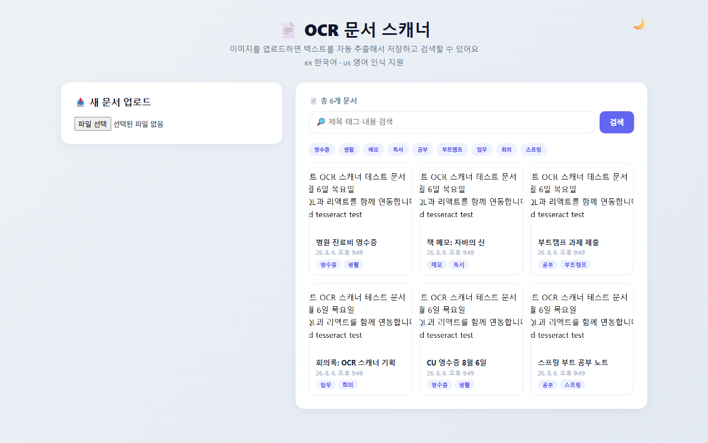
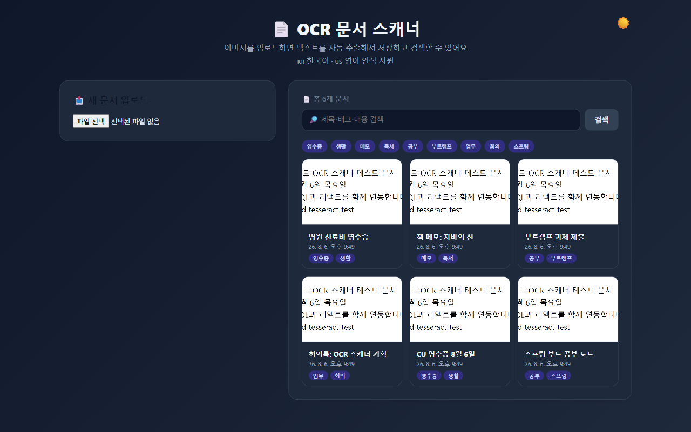
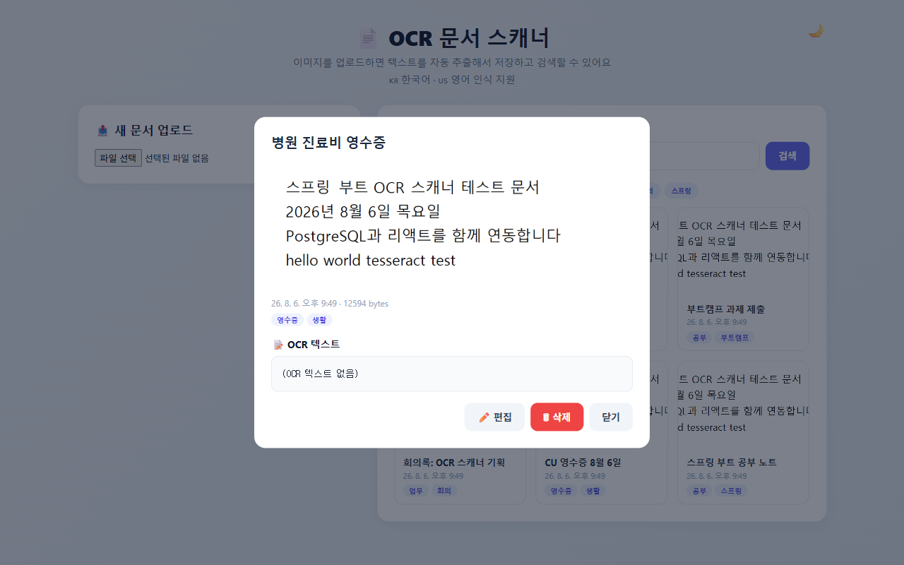

# OCR 문서 스캐너 (OCR Scanner)

이미지로 된 문서(영수증, 메모, 스캔본 등)를 업로드하면 네이버 CLOVA OCR로 텍스트를 추출하고, 서버에 저장해 나중에 검색/관리할 수 있는 문서 관리 애플리케이션입니다.

## 스크린샷

| 메인 화면 | 다크 모드 | 상세/편집 모달 |
|---|---|---|
|  |  |  |

## 주요 기능

- **이미지 업로드**: 파일 선택 → 미리보기 → OCR 실행 → 텍스트 수정 → 저장
- **OCR 텍스트 추출**: 네이버 CLOVA OCR API로 한국어+영어 텍스트 인식
- **문서 관리**: 목록/상세/수정/삭제 (CRUD)
- **검색**: 제목, OCR 텍스트, 태그 중 키워드가 포함된 문서 검색
- **태그 필터**: 태그 칩 클릭으로 필터링, 태그별 문서 수 표시
- **페이지네이션**: 12개 단위로 목록 페이지 이동
- **다크 모드**: localStorage에 설정 유지
- **업로드 검증**: 이미지 파일만 허용 (최대 10MB), 전역 예외 처리로 에러 응답 통일

## 기술 스택

| 구분 | 스택 |
|---|---|
| 백엔드 | Spring Boot 4.1.0 (Java 25), Spring Data JPA, Spring WebMVC, Lombok |
| 프론트엔드 | React 19, Vite 8 |
| OCR | 네이버 CLOVA OCR (API Gateway 연동) |
| DB | PostgreSQL 18 |
| 테스트 | JUnit 5, MockMvc, H2 |

## 프로젝트 구조

```
ocr-scanner/
├── src/main/java/com/example/ocrscanner/
│   ├── OcrScannerApplication.java          # 앱 진입점
│   ├── config/
│   │   ├── ClovaOcrProperties.java         # CLOVA OCR 설정 바인딩
│   │   └── CorsConfig.java
│   ├── controller/document/
│   │   ├── DocumentController.java         # 문서 CRUD Controller
│   │   └── OcrController.java              # CLOVA OCR 실행 Controller
│   ├── service/
│   │   ├── document/DocumentService.java   # Service
│   │   └── clova/ClovaOcrService.java      # CLOVA OCR 연동
│   ├── repository/document/
│   │   └── DocumentRepository.java         # Repository (JPA)
│   ├── entity/document/
│   │   └── Document.java                   # Entity
│   ├── dto/document/
│   │   └── DocumentResponse.java           # API 응답 DTO (Entity 노출 방지)
│   └── exception/
│       ├── DocumentNotFoundException.java  # 404 예외
│       ├── GlobalExceptionHandler.java     # 전역 예외 처리
│       └── ErrorResponse.java              # 에러 응답 형식
├── src/main/resources/
│   ├── application.example.yml     # 설정 예시 (커밋 대상)
│   └── application.yml             # 실제 설정 (git에 커밋 금지)
├── src/test/java/com/example/ocrscanner/   # JUnit + MockMvc 테스트
└── frontend/src/
    ├── App.jsx
    ├── api.js
    └── components/document/
        ├── UploadCard.jsx
        ├── DocumentList.jsx
        └── DocumentModal.jsx
```

## 실행 방법

### 사전 준비

- Java 25, Node.js, PostgreSQL 18이 설치되어 있어야 합니다.
- PostgreSQL에 `ocr_scanner` 데이터베이스를 생성합니다.

```sql
CREATE DATABASE ocr_scanner;
```

- `src/main/resources/application.example.yml`을 같은 위치에 `application.yml`로 복사한 뒤, DB 접속 정보와 CLOVA OCR API 키(Invoke URL, Secret Key)를 입력합니다.
- `application.yml`은 API 키를 포함하므로 **git에 커밋하지 않습니다**.

### 백엔드 실행

```bash
./mvnw spring-boot:run
```

`http://localhost:8080`에서 API가 실행됩니다.

### 프론트엔드 실행

```bash
cd frontend
npm install
npm run dev
```

`http://localhost:5173`(Vite 기본 포트)에서 접속할 수 있습니다.

### 테스트

```bash
./mvnw test
```

H2 인메모리 DB로 실행되며, CLOVA OCR 호출은 mock 처리됩니다.

## API 목록

| Method | Path | 설명 |
|---|---|---|
| POST | `/api/ocr` | 이미지에서 텍스트 추출 (multipart/form-data: file, lang) |
| POST | `/api/documents` | 문서 업로드 (multipart/form-data: file, title, tags, ocrText) |
| GET | `/api/documents` | 전체 문서 목록 (최신순) |
| GET | `/api/documents/search?q=키워드` | 제목/OCR텍스트/태그 검색 |
| GET | `/api/documents/{id}` | 문서 상세 조회 |
| GET | `/api/documents/{id}/image` | 저장된 원본 이미지 조회 |
| PATCH | `/api/documents/{id}` | 문서 수정 |
| DELETE | `/api/documents/{id}` | 문서 삭제 (DB + 저장 파일) |
